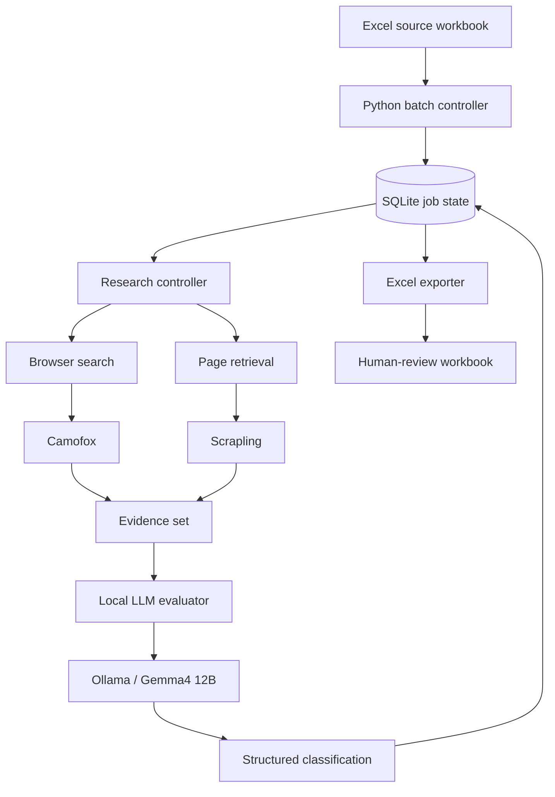

# Architecture

The pipeline enriches book records from a local (to me) library with series metadata using live web evidence and llm evaluation.

## Key design choices

- SQLite is the runtime source of truth rather than Excel.
- Each record is checkpointed independently.
- Interrupted work can be resumed.
- Web discovery and page retrieval are separated from LLM evaluation.
- Failed or ambiguous records can be retried without rerunning successful records.
